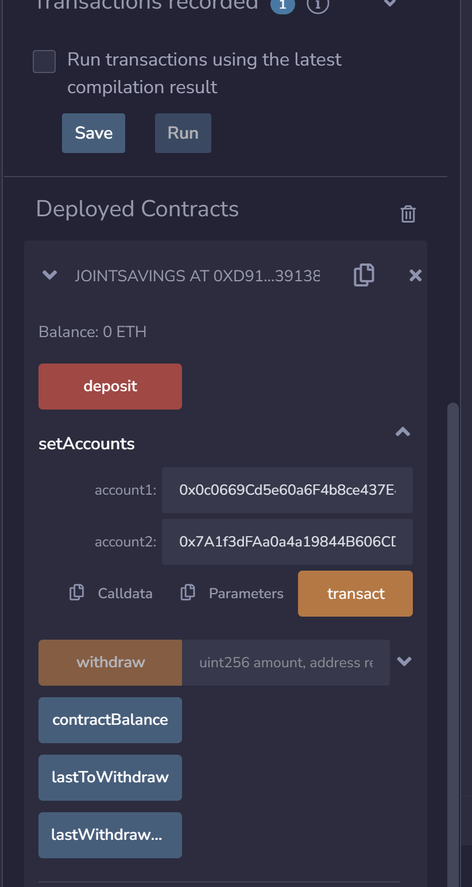
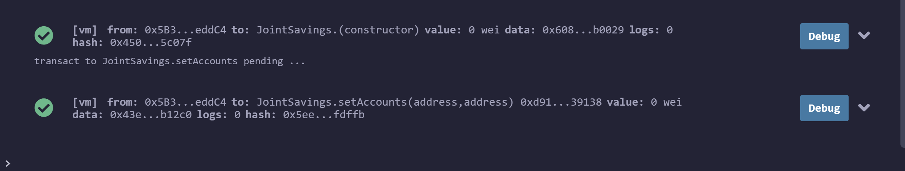
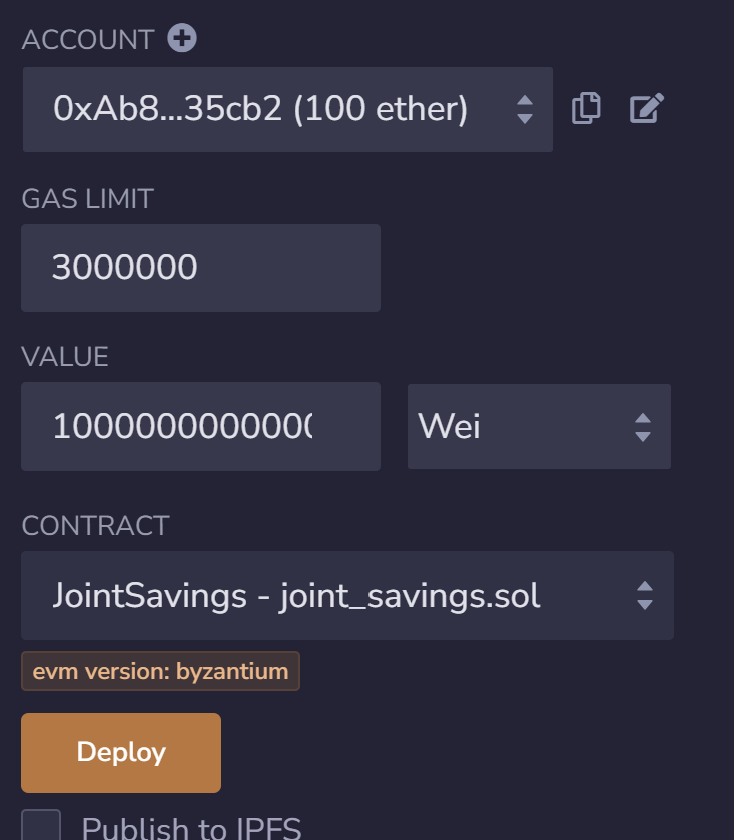
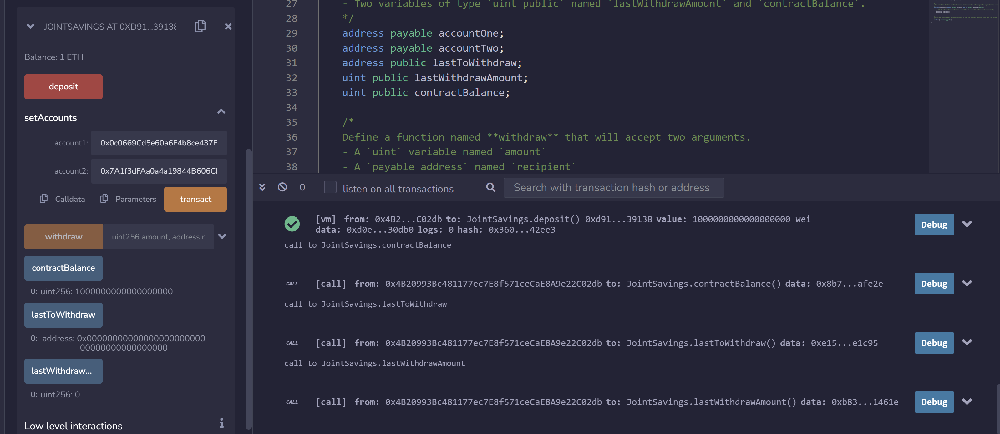
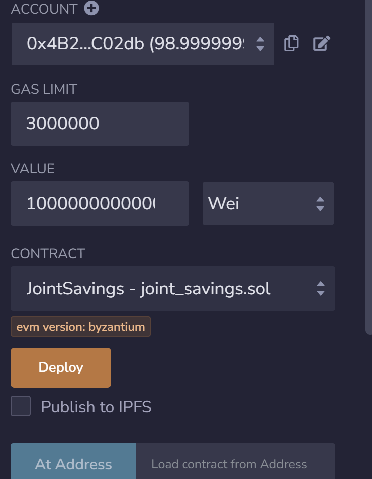
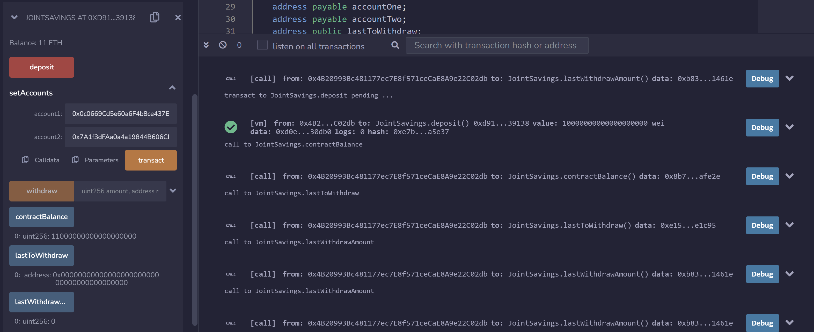
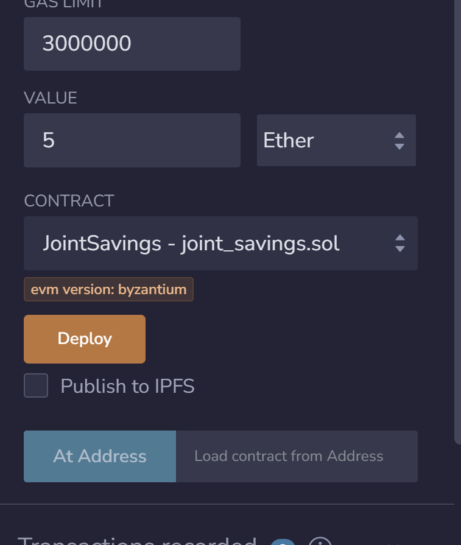
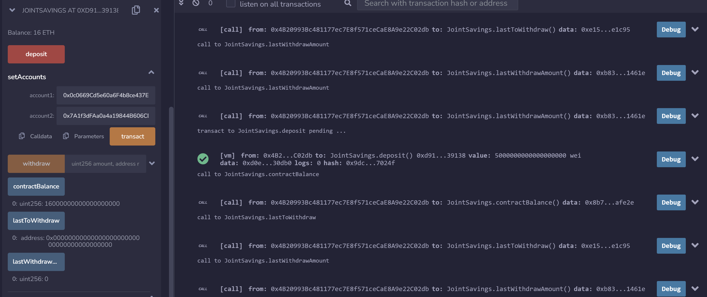
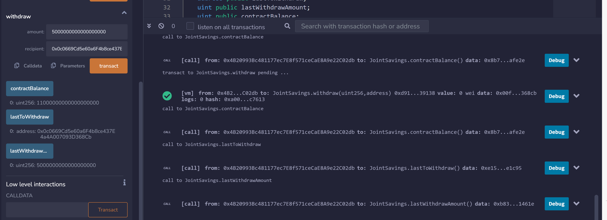
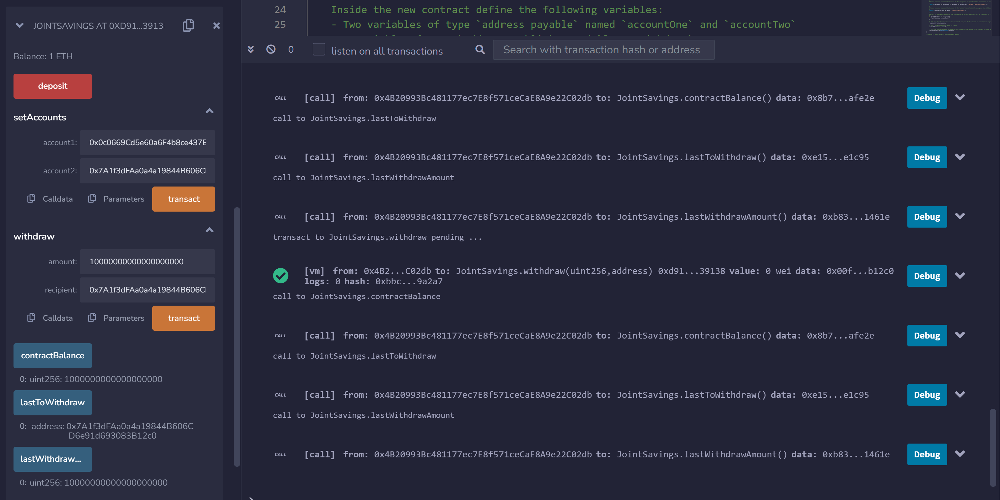

# Joint Savings Smart Contract

The Joint Savings Smart Contract leverages the power of blockchain technology to automate and enhance joint savings accounts within the finance industry. This Ethereum-compatible smart contract enables financial institutions to offer innovative joint savings account features while ensuring security, transparency, and efficiency.

---

## Technologies

The technologies used in this project include:

   * **Solidity**: The smart contract is written in [Solidity](https://soliditylang.org/), a high-level language for implementing smart contracts on the Ethereum blockchain.

   * **Remix IDE**: Remix IDE is the integrated development environment you used to develop, test, and deploy the smart contract. It provides a user-friendly interface for Ethereum smart contract development.
   

---


## Usage

To use this platform, follow these steps:

**Clone the Repository:** 

Clone this repository to your local machine using the following command:

   ```bash
   git clone https://github.com/AnaFilipaMartelo/Challenge20.git
  ```

**Open the Remix IDE:** 

 The Remix IDE is available in both web and desktop versions. We'll use the Web version of the [Remix IDE](https://remix.ethereum.org/). 
 
 Open the Solidity file named ```joint_savings.sol```. 

**Compile and Deploy Your Contract:** 

 Compile the smart contract and click the Deploy button to deploy it.  

**Define Ethereum Address:** 

Use the setAccounts function to define the authorized Ethereum address that will be able to withdraw funds from your contract. The following screeenshot demonstrates:



Click the ```transact``` button. Confirm in the terminal:



**Make Deposit:**  

Test the deposit functionality of your smart contract by sending the following amounts of ether:

- Transaction 1: Send 1 ether as wei. 

Insert the amount in the Value box and click the ```deposit``` button.



Verify Transaction:

    

- Transaction 2: 
         Send 10 ether as wei.



Verify Transaction:

  

- Transaction 3: 
         Send 5 ether.



Verify Transaction:

  

**Make Withdraw:**  

Test the contract’s withdrawal functionality by: 

- withdrawing 5 ether into accountOne:

Insert the amount in the ```deposit``` box under the withdraw  side bar. Copy the accountOne address into the recipient box. Click the ```transact``` button. 

Use the contractBalance function to verify that the funds were withdrawn from your contract. Also, use the lastToWithdraw and lastWithdrawAmount functions to verify that the address and amount were correct.

  

- Withdraw 10 ether into accountTwo:

  
 


---


## Contributors

* Ana Martelo (anafilipamartelo@gmail.com)

---

## License

MIT
